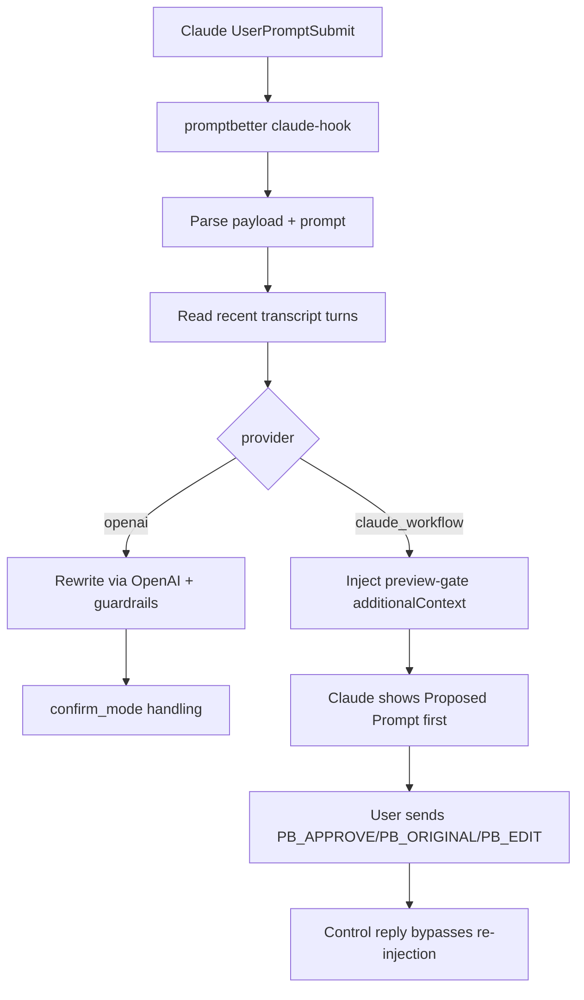

# Architecture (Claude-Only)

## 1) Components

1. CLI entry and routing
- [bin/promptbetter.js](/Users/anirudhmakhana/Documents/krsnalabs/promptbetter/bin/promptbetter.ts)
- [src/cli.js](/Users/anirudhmakhana/Documents/krsnalabs/promptbetter/src/cli.ts)

2. Commands
- Install/uninstall hook:
  - [src/commands/installClaude.js](/Users/anirudhmakhana/Documents/krsnalabs/promptbetter/src/commands/installClaude.ts)
  - [src/commands/uninstallClaude.js](/Users/anirudhmakhana/Documents/krsnalabs/promptbetter/src/commands/uninstallClaude.ts)
- Hook runtime:
  - [src/commands/claudeHook.js](/Users/anirudhmakhana/Documents/krsnalabs/promptbetter/src/commands/claudeHook.ts)
- Debug/ops:
  - [src/commands/improve.js](/Users/anirudhmakhana/Documents/krsnalabs/promptbetter/src/commands/improve.ts)
  - [src/commands/doctor.js](/Users/anirudhmakhana/Documents/krsnalabs/promptbetter/src/commands/doctor.ts)
  - [src/commands/configSet.js](/Users/anirudhmakhana/Documents/krsnalabs/promptbetter/src/commands/configSet.ts)

3. Core
- Config loader/validator: [src/config.js](/Users/anirudhmakhana/Documents/krsnalabs/promptbetter/src/config.ts)
- Hook payload/transcript parsing: [src/core/context.js](/Users/anirudhmakhana/Documents/krsnalabs/promptbetter/src/core/context.ts)
- Claude-native preview gate: [src/core/claudeWorkflow.js](/Users/anirudhmakhana/Documents/krsnalabs/promptbetter/src/core/claudeWorkflow.ts)
- Redaction/guardrails/rewrite orchestration:
  - [src/core/redact.js](/Users/anirudhmakhana/Documents/krsnalabs/promptbetter/src/core/redact.ts)
  - [src/core/guardrails.js](/Users/anirudhmakhana/Documents/krsnalabs/promptbetter/src/core/guardrails.ts)
  - [src/core/rewrite.js](/Users/anirudhmakhana/Documents/krsnalabs/promptbetter/src/core/rewrite.ts)
  - [src/core/heuristicRewrite.js](/Users/anirudhmakhana/Documents/krsnalabs/promptbetter/src/core/heuristicRewrite.ts)

4. Optional external provider
- OpenAI client: [src/provider/openai.js](/Users/anirudhmakhana/Documents/krsnalabs/promptbetter/src/provider/openai.ts)

5. Workspace skill
- [.claude/skills/promptbetter-preview/SKILL.md](/Users/anirudhmakhana/Documents/krsnalabs/promptbetter/.claude/skills/promptbetter-preview/SKILL.md)

## 2) Runtime flow

## 3) Data contract

Config path: `~/.promptbetter/config.toml`

Key fields:

- `provider = "claude_workflow" | "openai"`
- `confirm_mode = "auto_accept" | "always" | "skip"` (used in `openai` path)
- `[context].turns` (0-10)
- `[rewrite].policy` (`conservative|balanced|aggressive`)

## 4) Transparency model

In default mode (`claude_workflow`), promptbetter forces a preview-first protocol where Claude must present the rewritten prompt and wait for explicit user control token before execution.

## 5) Reliability model

- Hook failures are fail-open: original prompt flow continues.
- No persistent prompt history storage by default.
- Secret redaction applied before external provider calls.

## 6) Test coverage

- [test/config.test.js](/Users/anirudhmakhana/Documents/krsnalabs/promptbetter/test/config.test.ts)
- [test/context.test.js](/Users/anirudhmakhana/Documents/krsnalabs/promptbetter/test/context.test.ts)
- [test/guardrails.test.js](/Users/anirudhmakhana/Documents/krsnalabs/promptbetter/test/guardrails.test.ts)
- [test/rewrite.test.js](/Users/anirudhmakhana/Documents/krsnalabs/promptbetter/test/rewrite.test.ts)
- [test/install.test.js](/Users/anirudhmakhana/Documents/krsnalabs/promptbetter/test/install.test.ts)
- [test/claudeWorkflow.test.js](/Users/anirudhmakhana/Documents/krsnalabs/promptbetter/test/claudeWorkflow.test.ts)
