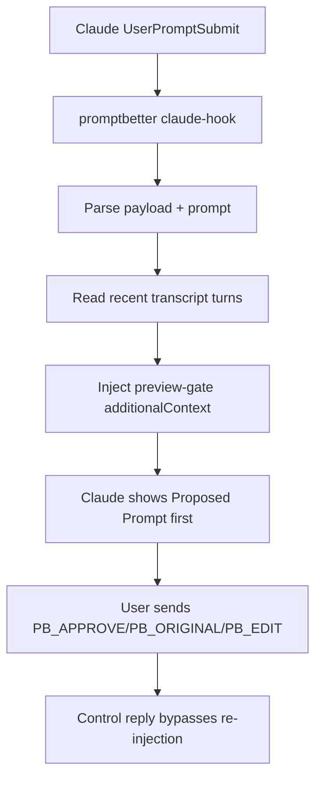

# Architecture (Claude-Only)

## 1) Components

1. CLI entry and routing
- [promptbetter.ts](../bin/promptbetter.ts)
- [cli.ts](../src/cli.ts)

2. Commands
- Install/uninstall hook:
  - [installClaude.ts](../src/commands/installClaude.ts)
  - [uninstallClaude.ts](../src/commands/uninstallClaude.ts)
- Hook runtime:
  - [claudeHook.ts](../src/commands/claudeHook.ts)
- Debug/ops:
  - [improve.ts](../src/commands/improve.ts)
  - [doctor.ts](../src/commands/doctor.ts)
  - [configSet.ts](../src/commands/configSet.ts)

3. Core
- Config loader/validator: [config.ts](../src/config.ts)
- Hook payload/transcript parsing: [context.ts](../src/core/context.ts)
- Preview gate: [claudeWorkflow.ts](../src/core/claudeWorkflow.ts)
- Local rewrite utilities:
  - [rewrite.ts](../src/core/rewrite.ts)
  - [heuristicRewrite.ts](../src/core/heuristicRewrite.ts)
  - [guardrails.ts](../src/core/guardrails.ts)
  - [redact.ts](../src/core/redact.ts)

4. Workspace skill
- [SKILL.md](../.claude/skills/promptbetter-preview/SKILL.md)

## 2) Runtime flow

## 3) Config contract

Config path: `~/.promptbetter/config.toml`

Supported keys:

- `[context].turns` (0-10)
- `[rewrite].policy` (`conservative|balanced|aggressive`)
- `[privacy].persist_history` (boolean)

## 4) Reliability model

- Hook failures are fail-open: original prompt flow continues.
- No persistent prompt history storage by default.
- No external model provider dependency.

## 5) Test coverage

- [config.test.ts](../test/config.test.ts)
- [context.test.ts](../test/context.test.ts)
- [guardrails.test.ts](../test/guardrails.test.ts)
- [rewrite.test.ts](../test/rewrite.test.ts)
- [install.test.ts](../test/install.test.ts)
- [claudeWorkflow.test.ts](../test/claudeWorkflow.test.ts)
